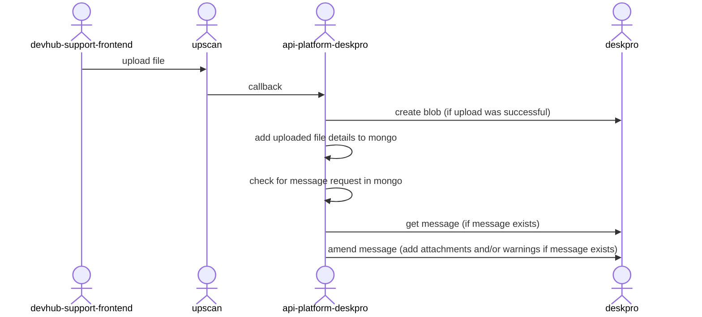
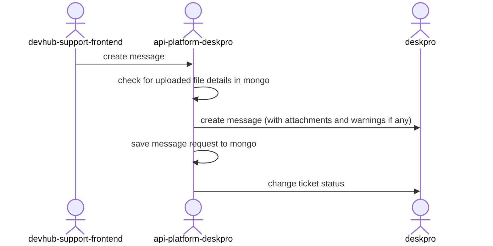

# API Platform Deskpro

Service for interfacing with Deskpro Horizon for use by API Platform.

It connects to Deskpro through the SQUID proxy.

## Requirements

This service is written in [Scala](http://www.scala-lang.org/) and [Play](http://playframework.com/), so needs at least a [JRE] to run.

## Tests

The tests include unit tests and integration tests.
In order to run them, use this command line:

```
./run_all_tests.sh
```

## Run the application

To run the application use the `run_local.sh` script to start the service.

Note that this service uses MongoDB, so MongoDB will have be set up locally.

## Running locally

Note that this service now uses internal auth to secure it's endpoints.

Use this to add an example token of '9614' when running locally (use run_local_with_dependencies.sh):

```
curl -X POST --location "http://localhost:8470/test-only/token" \
-H "content-type: application/json" \
-d "{

\"token\": \"9614\",

\"principal\": \"api-platform-deskpro-local-test\",

\"permissions\": [

{ \"resourceType\": \"api-platform-deskpro\", \"resourceLocation\": \"*\", \"actions\": [ \"READ\", \"WRITE\" ] }
]
}"
```

And then call the get organisation endpoint like so:

```
curl -X GET --location "http://localhost:9614/organisation/12" -H "Authorization: 9614"
```

## Adding 'Gatekeeper link' to Deskpro

Here are the instructions for creating a new widget, Gatekeeper link, to Deskpro.

Under Widgets select **Create Widget** and fill the tabs as follows:
  
### Description tab
Under the **Description** tab set the following
   - Title = Gatekeeper link
   - Description = Application and Developer links to GK

### Settings tab
Under the **Settings** tab create two Settings as follows

1. Gatekeeper base Url
     - Target = **Ticket**
     - Name = **gk_base_url**
     - Title = **Gatekeeper base URL**
     - Type = **String**
     - Required = **true**
     - Value = **https://admin.tax.service.gov.uk/api-gatekeeper** for Production or **https://admin.qa.tax.service.gov.uk/api-gatekeeper** for QA
2. Custom field number for Application ID
   - Target = **Ticket**
   - Name = **custom_field_num**
   - Title = **Custom field number for Application ID**
   - Type = **String**
   - Required = **true**
   - Value = **field.4** for [Production](https://github.com/hmrc/app-config-production/blob/main/api-platform-deskpro.yaml) or **field.9** for [QA](https://github.com/hmrc/api-platform-deskpro/blob/main/conf/application.conf). 
   The number prefixing "**field.**" (4 or 9) is set in the config property [*deskpro.application-id*](https://github.com/hmrc/app-config-production/blob/main/api-platform-deskpro.yaml).

### Code tab
Under the **Code** tab paste the contents of file [gatekeeper_link.html](https://github.com/hmrc/api-platform-deskpro/tree/main/deskprowidgets/gatekeeper_link.html) into the corresponding Head and Body sections.

Don't forget to **click save** before testing the link works.


## File Attachments

It is possible to add file attachments when creating a ticket in Deskpro, or when adding a new message to an existing Deskpro ticket.
We use upscan to upload the file and check for viruses, etc.

Note that warnings about any file upload failures or file uploads that are still in progress are added to the text of the Deskpro message.

### Uploading file to upscan and handling upscan callbacks



### Create Deskpro message with attachments




## License

This code is open source software licensed under the [Apache 2.0 License]("http://www.apache.org/licenses/LICENSE-2.0.html").